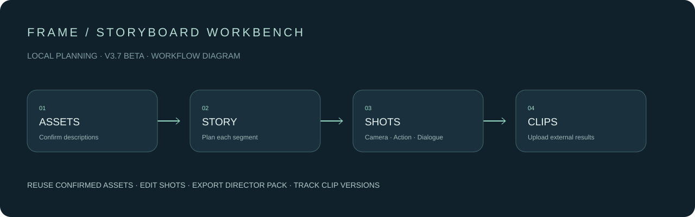

# FRAME · 分镜工作台

**把素材、故事、分镜与视频记录，整理在同一个本地导演工作台。**

`V3.7 Beta` · `Python 3.10+` · `Windows 优先` · `本地运行` · `暂时保留权利`

[English](docs/README.en.md) · [完整使用指南](docs/workbench-guide.md) · [更新记录](CHANGELOG.md) · [发布管理](docs/releasing.md)



> 当前为公开源码 Beta，暂未采用开源许可证。示意图描述工作流程，并非运行截图。

## 适合什么用途

为本地 AI 视频创作者整理素材说明、编排分镜、管理片段承接，并导出 H3 导演包。可以配合 Ollama 或兼容的文字模型接口使用。

**工作台负责策划与记录。图片和视频在外部工具生成，生成后可上传到对应片段。**

## 主要功能

| 功能 | 当前能力 |
|---|---|
| 导演画布 | 全屏、节点自由拖动、平移缩放、项目波纹、右侧详情调宽 |
| 素材管理 | 公共 / 本组素材、拖入替换、Picture 引用与具体说明 |
| 素材确认 | 人工确认或 AI 分析后确认；已确认说明供后续文字拆镜复用 |
| AI 拆镜 | 队列、分阶段耗时、生成进度、失败输出保存与重新解析 |
| 分镜编辑 | 镜头参数、动作、表情、对白、起止空间状态、历史版本 |
| 视觉参考库 | 可自定义说明及图片、GIF、MP4 / WebM 动态参考 |
| 提示词 | 片段内参考编号、最终提示词、历史与导出检查 |
| 视频记录 | 上传、播放、备注、按片段保存并随导演包打包 |
| 模型管理 | Ollama 模型检测、任务内复用、任务结束或手动卸载 |

## 快速开始

1. 安装 **Python 3.10 或更高版本**；程序运行不需要第三方 Python 包。
2. 从源码启动，或下载未来 Releases 中的 `FRAME-Storyboard-Workbench-v1.zip`，解压到固定目录。
3. Windows 双击 `Start-Windows.bat`。其他系统运行：

   ```bash
   python3 server.py
   ```

4. 浏览器访问 `http://127.0.0.1:8787`，点击「新建项目」。
5. 在「连接设置」填自己的模型服务地址和模型名称。
6. 添加素材并确认说明，再编排剧本、拆镜、编辑和导出。

源码下载也可直接启动，无需先构建前端。端口占用时可运行 `python server.py --port 8788`。不希望自动打开浏览器时加 `--no-browser`。

### Ollama 配置

先在自己电脑启动 Ollama，并安装所需模型。默认服务地址为 `http://127.0.0.1:11434`。纯文字拆镜选择文字模型；分析图片必须选择支持图片输入的视觉模型。模型推理速度取决于模型、量化、显存与输出长度。

## 更新与数据

关闭工作台网页及后台终端，把新 ZIP 拖到**原安装目录**的 `Update-Windows.bat`。更新程序会保留 `data/` 并将旧程序归档到 `versions/`。重启后按 Ctrl+F5。

- `data/` 保存项目、连接设置、素材说明及参考媒体；完整备份该目录。
- API Key 保存于本机设置，请勿上传 `data/` 到 GitHub。
- `versions/` 保存旧程序，不适合提交源码仓库。
- 连接模型服务时，请求内容会发送到你配置的服务；选择云接口时并非完全离线。
- 发布包名中的 `v1` 是沿用的文件名；实际软件版本以界面和 `version.json` 为准。

## 兼容性与已知限制

- H3 Director Pack **formatVersion 1**；不同导演台、节点版本需自行验证导入。
- Windows 启动脚本优先；其他系统的 Python 启动方式尚需更多实机测试。
- 本地测试通过不代表所有显卡、浏览器、模型或视频编码都能兼容。
- 视频播放依赖浏览器支持的编码；视频记录属于片段，不自动识别镜头归属。
- 单视频上限 50MB，项目视频合计上限 150MB，导演包解压资源上限约 400MB。
- 当前不提供图片 / 视频生成、视频剪辑合并或云托管服务。
- IDM 等浏览器插件可能拦截本地媒体；可在插件中排除 localhost。

## 开发与反馈

以下命令在 GitHub **源码目录**运行；安装 ZIP 不包含开发测试脚本。

```bash
python -m unittest discover -s tests -v
python tools/check_release.py
python tools/build_release.py
```

问题反馈请使用仓库 Issue 模板，附版本、复现步骤和脱敏错误信息。请勿公开真实客户资料、API Key 或完整个人导演包。重大隐私问题请通过仓库所有者的私下联系方式反馈。

## 权利与素材

项目目前 **All rights reserved**，详情见 [LICENSE](LICENSE)。仓库公开可见，尚未授予开源或一般商用许可；授权范围以 LICENSE 为准。

此仓库排除了原内部测试导演包、人物图、店铺图片及生成视频。运行程序时所使用的模型、节点、工作流和外部素材各自适用其权利要求。见 [来源说明](NOTICE.md)。
