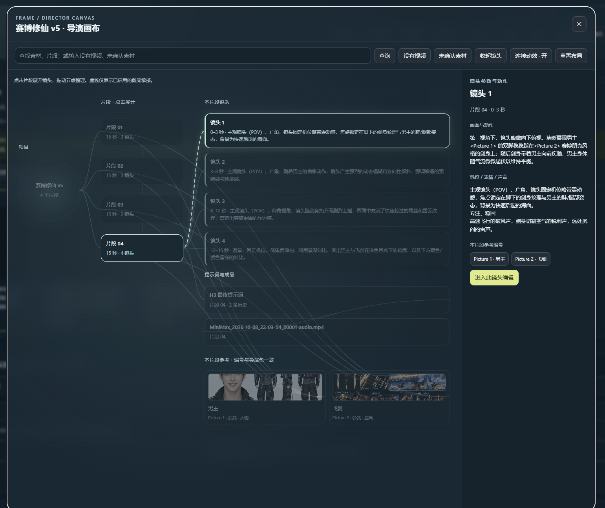

# 第一次使用 FRAME：从故事到导演包

[返回首页](../README.md) · [常见问题](faq.md) · [完整功能与历史说明](workbench-guide.md)

工作台用来整理素材、写故事、拆分镜头和导出提示词。**它不生成图片或视频**：在外部工具生成视频后，把文件放回对应片段即可记录版本。

## 先体验，不用先连接 AI

1. 按下面“安装与启动”运行工作台。
2. 下载 [咖啡店入门导演包](https://github.com/Alan-Poo-Kai-Lun/frame-storyboard-workbench/blob/main/docs/examples/cafe-demo.mmxpack.zip)（在文件页面点 Download raw file）。
3. 在工作台顶部点击 **导入导演包**，选择这个 ZIP。
4. 点击三个镜头，查看右边的动作、机位和对白；点击 **H3 Prompt** 查看组装结果。
5. 点击 **项目总览**，查看片段、素材与提示词之间的关系。

示例包含 3 张自绘示意素材、1 个 15 秒片段、3 个人工编写镜头。它不是 AI 输出，不含成片或真实人物，也不用于展示模型质量。导入会替换当前项目，请先导出已有项目作为备份。

## 对接 ComfyUI 前先看

导出的导演包面向 **AI 搅拌手（AIMixer）的 H3 导演台**。工作台启动成功不代表 ComfyUI 已安装这个节点。请先阅读 [导演台依赖、正确导入位置与兼容限制](h3-director-compatibility.md)，不要把导演包当作普通工作流 JSON 拖到 ComfyUI 画布。

## 1. 安装与启动

需要 Python 3.10 或更高版本。Windows 安装 Python 时启用 **Add Python to PATH**，安装后重新打开终端。程序不需要 `pip install`。

1. 打开仓库首页 → **Code → Download ZIP**。
2. 完整解压，进入包含 `server.py` 和 `Start-Windows.bat` 的文件夹。不要直接在压缩包里启动。
3. 双击 **Start-Windows.bat**。出现终端后保持它打开。
4. 浏览器打开 **http://127.0.0.1:8787**。

其他系统可以在源码目录运行：

```bash
python3 server.py --no-browser
```

正常打开后，顶部能看到版本 `V3.7`、“新建项目”和“连接设置”。浏览器打不开、窗口闪退或端口占用，见 [启动排查](faq.md#启动与更新)。

## 2. 认识三个区域

| 区域 | 用来做什么 | 第一次先操作什么 |
|---|---|---|
| 左边 | 当前片段故事、画幅、对白语言、片段列表、公共素材 | 写故事、拖入素材 |
| 中间 | 镜头卡片、本组素材、视频记录、时间线 | 选择镜头、查看 H3 Prompt |
| 右边 | 当前镜头动作、摄影机、专业参数、表情、对白、空间状态 | 核对并修改镜头 |
| 顶部 | 新建、总览、参考库、任务、导入导出、连接设置 | 新建项目或导入示例 |

三栏分别滚动；拖动两条竖向分隔线调整宽度。中间模块可以折叠，左边片段与素材也能折叠。顶部主题按钮显示的是**准备切换到的主题**。

### 真实画布截图



这张真实截图来自维护者先前的演示项目，展示的是 **V3.7 升级前的画布**，含虚构角色与飞剑参考缩略图；不是新版全屏效果，也不是生成质量承诺。V3.7 增加了全屏、平移缩放和详情栏调宽。工作台截图与流程示意图在本文中明确区分。

## 3. 新建项目与片段

1. 点顶部 **＋ 新建项目**，修改项目名称。
2. 在左边选择 **画幅**，例如 `9:16` 竖屏或 `16:9` 横屏。
3. 点击中间 **片段设置** 修改片段名称和时长。新片段默认 15 秒。
4. 左边 **SEGMENTS** 的 `＋` 添加下一段；拖动片段把手 `⠿` 调整顺序。

每个片段有自己的故事、素材和分镜。要沿用上一段，可以 **复制整段**；副本有独立镜头与本组素材，原片段的视频不会复制过去。

## 4. 上传素材，并确认说明

**这一步影响后续拆镜是否准确，不能只上传图片或只写一个名称。**

1. 将 PNG / JPG / WebP 拖进左边 **公共素材**：这些素材供所有片段使用。
2. 只属于当前片段的素材，展开中间 **当前片段素材** → 拖入图片，或点 **＋ 本组素材**。
3. 在卡片填写名称、类型和 **具体说明**。
4. 二选一：
   - 已经核对过图片：点击 **确认使用我的说明**。
   - 想让 AI 看图：点击 **AI 分析说明**，到任务中心查看，返回卡片 **查看并确认 AI 说明**，修正后确认。
5. 卡片显示“人工确认”或“AI 已分析 · 已确认”后，再开始文字拆镜。

人工确认不会让 AI 再看图。AI 草稿保存后也不会直接覆盖原说明，必须确认采用。换图、改说明或场景布局后，需要重新确认。

说明例子：

```text
人物 A：短发，浅棕色上衣，神态平和。保持服装和外观一致。
人物 B：短发，蓝绿色上衣，站在柜台后，面向来客。
场景：以参考图机位为准，入口在画面左侧，木色柜台在右侧；
两者之间通路畅通。只使用可见区域，不猜测未拍到的房间。
```

场景卡片还可以点击 **场景基准布局**，填写参考机位、左右物件和通路，勾选已核对后保存，再重新确认素材说明。

把新图片拖到已有卡片上可替换素材。替换公共素材会影响使用它的所有片段；只想改一段时，先使用本组素材。

## 5. 写故事并使用 Picture 引用

在左边“故事 / 剧本”中输入 `@`，从提示列表选择素材。不要凭记忆猜编号。**当前片段显示及最终导出的编号可能与全项目内部编号不同，始终以本片段为准。**

可以复制这段入门故事：

```text
在 @Picture 3 的咖啡店里，@Picture 1 从左侧入口走进来，
沿中央通路停在右侧柜台前。@Picture 2 站在柜台后，
面向来客微笑招呼：“你好，欢迎光临。”

15 秒，三个镜头。入口和柜台位置保持固定，不跨越柜台。
第 1 镜头交代空间，第 2 镜头招呼，第 3 镜头点头回应。
```

这段文字的前提是 Picture 1 = 人物 A、Picture 2 = 人物 B、Picture 3 = 咖啡店。你的素材顺序不同时，通过 `@` 菜单选对对象再改写。

左边 **对白语言 · 项目默认** 约束新台词；右边可以为某个镜头单独指定语言。已有台词不会自动翻译。**本片段故事历史** 用来查看和恢复以前写过的内容。

## 6. 连接模型（AI 操作才需要）

点顶部 **连接设置**。

| 字段 | 本地 Ollama 怎么填 |
|---|---|
| 接口 | Ollama（本机） |
| 服务地址 | `http://127.0.0.1:11434`，前提是 Ollama 运行在同一电脑 |
| 拆镜 / 审查模型 | 点击“读取 Ollama 模型”，选你已安装的文字模型；复制完整模型名称 |
| 素材视觉模型 | 选支持图片输入的模型；仅人工确认素材时可以不使用它 |
| API Key | 本地默认 Ollama 不需要填写 |
| 素材分析输出上限 | 默认 2048 tokens，先用默认值 |
| 文字输出上限 | 默认 4096 tokens，复杂任务再调整 |

点 **测试并保存**，看到成功信息后关闭。设置自动保存，下次打开会读取。模型名称必须是你实际安装的名称，不能照抄截图里的示例文字。

兼容接口选择 OpenAI Compatible API；地址填写服务提供方要求的 `/v1` 入口和有效模型 ID。请求会发送到你配置的服务。

## 7. AI 拆镜 → 预览 → 应用

1. 确认素材说明有效，选择要处理的片段。
2. 点击左边 **AI 拆镜**。
3. 在状态栏或顶部 **任务中心** 查看排队、当前阶段、输出量和耗时。输出字数不是完成百分比。
4. 完成后点击 **查看结果**，核对镜头数量、时间、人物、空间和原台词。
5. 预览窗口底部点击 **应用分镜**；来源有修改时，先核对差异再应用已有结果。

任务完成不等于已经写入镜头卡片，**还需要应用**。拆镜使用有效的已确认说明，不重新逐张看图；确认错误的说明仍会传入错误信息。

若任务失败但已保存模型输出，优先 **重新解析已有输出**，可以不重新推理；“重新推理”才会再次调用模型。达到输出上限而截断的内容不能直接应用。

## 8. 编辑、承接与导出

1. 中间点击镜头卡片，右边修改动作、摄影机、表情、对白和起止空间状态。
2. **专业镜头参数** 支持输入自定义值；点击旁边“图示”查看参考。自定义参考可加入图片、GIF 或视频。
3. 核对所有镜头覆盖完整时长。例如 15 秒可以是 `0–5 / 5–10 / 10–15` 秒，不留间隙，不重叠。
4. 下一段在 **片段设置** 启用“承接上一段”；先应用上一段分镜，再规划下一段。
5. **段间引导** 是给导演包的外部生成设置；与文字承接是两件事，按实际工作流分别设置。
6. 点击 **H3 Prompt** 检查最终本片段 Picture 编号和台词。
7. 点击顶部 **导出 H3 包**，阅读导出检查，修复问题后下载 `.mmxpack.zip`。

智能修复会调用文字模型并先预览。强制导出不会修复语义，只在包内附问题清单；媒体缺失或结构无效仍可能阻止导出。导出后到 **AI 搅拌手 H3 导演台节点的「导入导演包」** 中选择 ZIP。不是 ComfyUI 的通用工作流导入入口。导入后核对 Picture 对应图片、时长、任务类型、模型和采样设置，再执行。不同插件版本需实际验证，见 [对接说明](h3-director-compatibility.md)。

## 9. 保存已经生成的视频

1. 先选择对应片段。
2. 展开中间 **本片段视频记录**，拖入 MP4 / WebM / MOV，填写备注。
3. 在这里播放并核对；视频文件与备注随导演包导出。

单个视频上限 50MB，项目视频合计上限 150MB。推荐浏览器能播放的 H.264 MP4。工作台记录视频，不负责拼接片段、压缩或剪辑成片。

## 10. 下次打开与备份

关闭后仍从**同一个安装目录**启动，项目和设置保存在 `data/`。定期备份整个 `data/`，重要项目另导出导演包。不要把 `data/` 提交到公开仓库。

更新时先关闭后台程序，把发布安装 ZIP 拖到原目录的 **Update-Windows.bat**。不要把 GitHub 的源码 ZIP 当作安装更新 ZIP 使用。没有 Releases 安装包时，使用源码作为新安装，并先备份旧数据。
